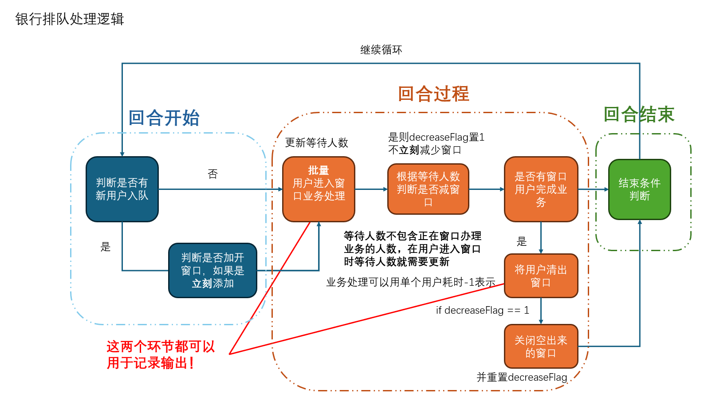

# BUAA-DS-Bank
银行排队一题祸害久矣，写一篇题解作为参考帮助大家学习理解，希望不要直接ctrl+c ctrl+v
## 银行题干翻译：

银行最少开设3个窗口，最多开设5个窗口

等待人数=大厅总人数-正在办理业务的人数
平均等待人数=等待人数/窗口数

当该周期有新人到来，且新人到来后平均等待人数大于等于7人，窗口数增加至使得平均等待人数小于7人或窗口上限 
当一个周期的客户全部进入窗口接收服务后，平均等待人数小于7人，则关闭**下一个**空出来的窗口 

题目要求输出每一个客户的**等待时间**，即在客户进入窗口办理业务时停止计算其等待时间

## 代码流程图

## 一点小结
银行这个题本身不难，是典型的题干描述不清+标准答案思路离奇。助教自己大约30分钟写完后就开始debug，对着数据点手算推了差不多3h还是没猜明白出题人想干啥，最后受不了去翻参考答案代码，眉头紧皱着看了半天，只能红温着改自己的代码作罢。往年也有所谓“圣经”流传下来，但多少有描述含糊的地方，不自己写一遍确实也一时想不起来这题有多逆天，学生问起来也不好回答。原参考代码可读性不好，我自己的代码习惯也有点不伦不类，总之还是希望能够帮助大家节省时间，不必平白无故被一道出得不好的题浪费一整天
